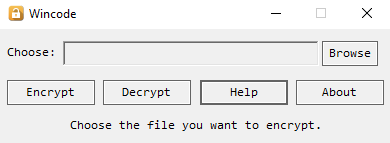

# Wincode
A mfc app for files encryption.:sparkles:

#### download it <a href="https://github.com/bestoak/wincode/raw/master/download/Wincode.zip" target="_blank">here</a>.

### How to use.
1. Choose the file you want to encrypt.
2. Click encrypt button.
3. Support all file types.
4. Do the same for decryption.

